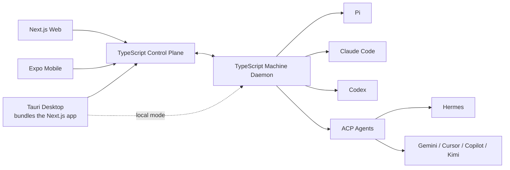

<h1 align="center">Zosma Cowork</h1>

<p align="center">
  
</p>

<h3 align="center">The open-source AI work platform for companies and teams</h3>

<p align="center">Run AI coworkers across employee machines, servers, and harnesses from one secure workspace.</p>

<p align="center">
  <a href="https://github.com/zosmaai/zosma-cowork/actions/workflows/ci.yml"></a>
  <a href="https://github.com/zosmaai/zosma-cowork/releases/latest"></a>
  <a href="LICENSE"></a>
  <a href="#roadmap"></a>
  <a href="https://discord.com/invite/HQcyTD5jHA"></a>
  <a href="https://github.com/zosmaai/zosma-cowork/stargazers"></a>
</p>

<p align="center">
  <a href="https://cowork.zosma.ai">Documentation</a> · <a href="https://github.com/zosmaai/zosma-cowork/releases/latest">Releases</a> · <a href="#roadmap">Roadmap</a> · <a href="https://discord.com/invite/HQcyTD5jHA">Discord</a>
</p>


---

Zosma Cowork is an **MIT-licensed, work-focused AI agent platform**. It gives people and teams one place to delegate work, supervise long-running agents, review approvals, and collect results—without forcing everyone to use the same model or agent harness.

Cowork is built for more than software development. It is intended for finance, operations, research, sales, support, administration, and engineering teams working with files, applications, business systems, and repeatable processes.

> **Project status:** Cowork ships as a local Pi-powered web application in a thin Tauri shell. The transport-independent Pi backend, versioned `/api/v1` discovery and read-only session slice are shipped; the next slices move interactive commands and events behind the same boundary. The machine daemon, control plane, mobile client, and additional harness adapters remain planned.


## What Cowork Is

Cowork is an open-source, MIT-licensed work harness for individuals, small teams, and large organizations. It runs in the cloud or on your own machines, stays provider-agnostic, and lets you use the model of your choice. Thanks to Pi and other open-source packages, Cowork stands on the shoulders of the open-source ecosystem rather than reinventing it.

## What Cowork Is Not

Cowork is not a coding assistant that opens a folder. It is not tied to a single provider, model, or harness — you choose the tools that fit the work.

## What Cowork Wants to Be

A single, open work platform where a person, a small team, or a whole company can run their AI work across any provider and any model, from any device, under a permissive MIT license — on the infrastructure of their choosing.

## Our Goal

To work with agents as seamlessly as possible.

Chat, get notifications of clarifications, information, and approvals — and schedule repeated tasks as you talk to the harness.

The agents create skills, learn from past experiences, and grow the more you use them.

That's the goal.

## Product vision

A company installs one lightweight Cowork daemon on each employee machine or managed server. The daemon discovers and supervises supported agent harnesses, keeps credentials and execution local, and opens an authenticated outbound connection to the Cowork backend.

People use the web, mobile, or desktop app to start work, monitor sessions, answer questions, approve sensitive actions, and review outputs from anywhere.



### One daemon, many harnesses

The machine daemon owns the capabilities every harness needs:

- process and session supervision
- reconnects, heartbeats, and crash recovery
- files, Git, worktrees, terminals, and artifacts
- local credentials and machine capabilities
- approvals and organization policy enforcement
- normalized events for every client

Harness adapters only translate between native harness protocols and Cowork's protocol. We prefer SDKs, JSON-RPC, JSONL, native APIs, and ACP over terminal-screen scraping.

### Agents of your choosing

Cowork plans to support multiple agent harnesses, chosen per employee's job type and the work they do — starting with our favourite, the Pi Coding Agent. Pi remains Cowork's first-class runtime: existing Pi extensions, skills, prompts, providers, steering, session trees, and deeper runtime controls stay available.

Each harness advertises its own capabilities rather than being forced into a lowest-common-denominator interface, so the app exposes richer controls whenever a selected harness supports them.

| Harness | Integration | Status |
|---|---|---|
| Pi | Native TypeScript SDK | ✅ First-class runtime; backend extraction and `/api/v1` read slice shipped |
| Claude Code | Native structured integration | ⬜ Planned |
| Codex | Native app-server integration | ⬜ Planned |
| ACP-compatible agents | Agent Client Protocol adapter | ⬜ Planned |
| Hermes | ACP first, native adapter only if needed | ⬜ Planned |

## Applications

The target monorepo has three user-facing applications:

```text
apps/
├── web/       # Next.js web application
├── app/       # React Native application built with Expo
└── desktop/   # Tauri shell that bundles and renders apps/web
```

### Web

The Next.js application is the complete browser experience for individuals, teams, and administrators.

### App

The Expo application provides native mobile sessions, push notifications, voice input, approvals, task monitoring, and artifact review.

### Desktop

The Tauri application does not maintain a second frontend. In development it loads `apps/web`; release builds bundle the Next.js standalone server and machine daemon, supervise both processes, and render the local Next.js application in an Tauri window.

## Repository structure

```text
zosma-cowork/
├── apps/
│   ├── daemon/              # TypeScript machine service: HTTP (Hono) + RPC + SSE, supervised by desktop
│   ├── desktop/             # Tauri shell; bundles apps/web + apps/daemon (Rust, per-app package.json)
│   ├── oauth-broker/        # Google OAuth broker for desktop sign-in (standalone, own npm lockfile)
│   ├── web/                 # Next.js app + packaged standalone server (dev port 30141)
│   └── website/             # Marketing / documentation site (Next.js, Turbopack)
├── packages/
│   └── protocol/            # Shared runtime schemas, commands, and events
├── docs/                    # Design docs, security notes, plans, superpowers roadmaps
├── scripts/                 # Shared helper scripts (check-shared-port, validate-release-config)
├── .github/                 # CI/CD: ci.yml, security.yml, release.yml
├── pnpm-workspace.yaml
├── pnpm-lock.yaml
└── package.json
```

The desktop app bundles the packaged Next.js server (`web/dist-server`) and the machine daemon, supervises both processes, and renders the local Next.js application in a Tauri window. The daemon is a standalone Hono HTTP server (health, IPC dispatch, SSE) that the web tier proxies to over `/api/v1`.

## Deployment modes

| Mode | Description | Status |
|---|---|---|
| Local | Desktop talks directly to the local web/runtime bundle | ✅ Current product; standalone machine daemon is next |
| Hosted | Zosma control plane connects users and company machines | ⬜ Planned |
| Self-hosted | Company operates the control plane in its own environment | ⬜ Planned |

The daemon initiates outbound connections, so employee machines do not need publicly exposed ports. Provider credentials remain on the machine unless an organization explicitly configures managed credentials.

## Roadmap

> **Last updated:** 2026-09-09
> **Current state:** API foundation shipped; interactive API cutover is next.

This roadmap tracks the product that exists today and the next architecture slices. The detailed implementation plan lives in [`docs/superpowers/roadmaps/2026-09-07-modular-headless-pi-backend-roadmap.md`](docs/superpowers/roadmaps/2026-09-07-modular-headless-pi-backend-roadmap.md).

### Shipped

- [x] Tauri shell and Next.js web UI migration
- [x] Pi backend contracts, errors, runtime manager, session services, and model services
- [x] Versioned `/api/v1` health, capability, model, runtime-state, and read-only session endpoints
- [x] Persistent sessions, session trees, concurrent runs, streaming, tools, files, Git, worktrees, extensions, and provider configuration
- [x] Cross-platform desktop packaging and local-first operation

### Current focus

- [ ] 🚧 Move session creation, prompts, abort, steering, follow-ups, queues, and SSE onto `/api/v1`
- [ ] 🚧 Move runtime controls, tools, compaction, Bash, model/thinking controls, and reload onto `/api/v1`
- [ ] 🚧 Finish history, branching, export, and extension-UI API adapters

### Next platform slices

- [ ] Workspace, file, and file-index APIs
- [ ] Git status, diffs, and worktree APIs
- [ ] Model configuration, project trust, provider credentials, and OAuth APIs
- [ ] Skills, plugins, updates, and remaining utility APIs
- [ ] Retire legacy agent/session/model routes after browser migration is complete

### Product direction

- [ ] TypeScript machine daemon with local credentials, supervision, reconnects, and approvals
- [ ] Hosted and self-hosted TypeScript control plane
- [ ] Web, Tauri desktop, and Expo mobile clients using shared protocol contracts
- [ ] Native Pi, Claude Code, Codex, and ACP harness adapters
- [ ] Team workspaces, scheduled work, policies, audit history, and usage controls

For the implementation sequence, see [`ROADMAP.md`](ROADMAP.md) and the dated design plans under [`docs/superpowers/`](docs/superpowers/).
## What works today

The current release is a local Pi-powered Cowork application with persistent sessions, streaming, tools, files, Git support, extensions, model configuration, and packaged desktop builds. The current web/Tauri runtime is the stable product surface while the standalone daemon and control-plane architecture are developed.

Download the current release from [GitHub Releases](https://github.com/zosmaai/zosma-cowork/releases/latest).

### Build

Requirements:

- Node.js 22.19 or newer
- pnpm 10
- Rust 1.85 or newer for the Tauri shell (`apps/desktop`)

```bash
git clone https://github.com/zosmaai/zosma-cowork.git
cd zosma-cowork

corepack enable
pnpm install

# Browser development server (web + daemon supervisor)
pnpm web:dev

# Full desktop application (Tauri window loading apps/web)
pnpm dev

# Marketing/docs site
pnpm website:dev
```

Useful checks (run from the repo root):

```bash
pnpm test          # all workspace packages (protocol, web, daemon)
pnpm lint
pnpm typecheck
pnpm web:build     # Next.js build + package-server → web/dist-server
pnpm daemon:build
pnpm desktop:build # Tauri release bundle (needs TAURI_SIGNING_PRIVATE_KEY for signed updater)
```

## Principles

1. **Work is the product.** The agent and harness should disappear behind the result.
2. **Humans remain accountable.** Sensitive actions require visible policy and approval.
3. **Execution stays close to the work.** The daemon runs on company-controlled machines and servers.
4. **No harness lock-in.** Use Pi deeply while supporting structured alternatives.
5. **Open-source honest.** No dark patterns, hidden execution, or artificial engagement loops.
6. **Boring infrastructure wins.** Start with a modular monolith and one daemon; split only when measured constraints demand it.

## Open-source

Zosma Cowork is released under the permissive MIT License. Third-party harnesses, models, extensions, and services keep their own licenses and terms.

## Contributing

Contributions are welcome across the daemon, backend, applications, adapters, extensions, documentation, design, and testing.

Before starting a large change, open an issue or join the [Discord community](https://discord.com/invite/HQcyTD5jHA) so the implementation fits the current migration phase.

<a href="https://github.com/zosmaai/zosma-cowork/graphs/contributors">
  
</a>

  <a href="https://github.com/zosmaai/zosma-cowork/stargazers">
    
  </a>

## Citation

```bibtex
@software{zosma_cowork,
  author  = {Nayak, Arjun and Mhaskar, Akshay and Shanvit and Mishra, Devendra},
  title   = {{Zosma Cowork: An Open-Source AI Work Platform}},
  url     = {https://github.com/zosmaai/zosma-cowork},
  year    = {2026}
}
```

## License

[MIT](LICENSE) © [Zosma AI](https://zosma.ai)
