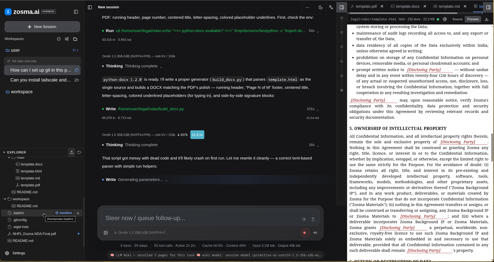
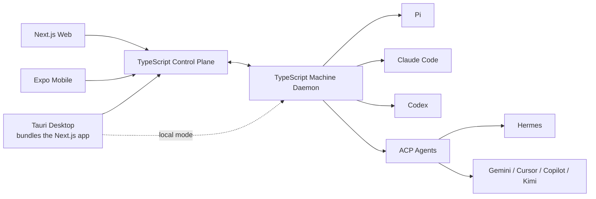

<div align="center">
# Zosma Cowork


### The open-source AI work platform for companies and teams

Run AI coworkers across employee machines, servers, and harnesses from one secure workspace.

[](https://github.com/zosmaai/zosma-cowork/actions/workflows/ci.yml)
[](https://github.com/zosmaai/zosma-cowork/releases/latest)
[](LICENSE)
[](#roadmap)
[](https://discord.com/invite/HQcyTD5jHA)
[](https://github.com/zosmaai/zosma-cowork/stargazers)

[Documentation](https://cowork.zosma.ai) · [Releases](https://github.com/zosmaai/zosma-cowork/releases/latest) · [Roadmap](#roadmap) · [Discord](https://discord.com/invite/HQcyTD5jHA)
</div>


---

Zosma Cowork is an **MIT-licensed, work-focused AI agent platform**. It gives people and teams one place to delegate work, supervise long-running agents, review approvals, and collect results—without forcing everyone to use the same model or agent harness.

Cowork is built for more than software development. It is intended for finance, operations, research, sales, support, administration, and engineering teams working with files, applications, business systems, and repeatable processes.

> **Project status:** Cowork already ships a capable local, Pi-powered application. We are now rebuilding its architecture around a TypeScript machine daemon, central control plane, Next.js web app, Expo mobile app, and Tauri desktop app. The checklist below distinguishes shipped functionality from work in progress and planned work.



## What Cowork Is

Cowork is an open-source, MIT-licensed work harness for individuals, small teams, and large organizations. It runs in the cloud or on your own machines, stays provider-agnostic, and lets you use the model of your choice. Thanks to Pi and other open-source packages, Cowork stands on the shoulders of the open-source ecosystem rather than reinventing it.

## What Cowork Is Not

Cowork is not a coding assistant that opens a folder. It is not tied to a single provider, model, or harness — you choose the tools that fit the work.

## What Cowork Wants to Be

A single, open work platform where a person, a small team, or a whole company can run their AI work across any provider and any model, from any device, under a permissive MIT license — on the infrastructure of their choosing.

## Our Goal

To work with agents as seamlessly as possible.

Chat, get notifications of clarifications, information, and approvals — and schedule repeated tasks as you talk to the harness.

The agents create skills, learn from past experiences, and grow the more you use them.

That's the goal.

## Product vision

A company installs one lightweight Cowork daemon on each employee machine or managed server. The daemon discovers and supervises supported agent harnesses, keeps credentials and execution local, and opens an authenticated outbound connection to the Cowork backend.

People use the web, mobile, or desktop app to start work, monitor sessions, answer questions, approve sensitive actions, and review outputs from anywhere.



### One daemon, many harnesses

The machine daemon owns the capabilities every harness needs:

- process and session supervision
- reconnects, heartbeats, and crash recovery
- files, Git, worktrees, terminals, and artifacts
- local credentials and machine capabilities
- approvals and organization policy enforcement
- normalized events for every client

Harness adapters only translate between native harness protocols and Cowork's protocol. We prefer SDKs, JSON-RPC, JSONL, native APIs, and ACP over terminal-screen scraping.

### Agents of your choosing

Cowork plans to support multiple agent harnesses, chosen per employee's job type and the work they do — starting with our favourite, the Pi Coding Agent. Pi remains Cowork's first-class runtime: existing Pi extensions, skills, prompts, providers, steering, session trees, and deeper runtime controls stay available.

Each harness advertises its own capabilities rather than being forced into a lowest-common-denominator interface, so the app exposes richer controls whenever a selected harness supports them.

| Harness | Integration | Status |
|---|---|---|
| Pi | Native TypeScript SDK | ✅ Available today; daemon migration in progress |
| Claude Code | Native structured integration | ⬜ Planned |
| Codex | Native app-server integration | ⬜ Planned |
| ACP-compatible agents | Agent Client Protocol adapter | ⬜ Planned |
| Hermes | ACP first, native adapter only if needed | ⬜ Planned |

## Applications

The target monorepo has three user-facing applications:

```text
apps/
├── web/       # Next.js web application
├── app/       # React Native application built with Expo
└── desktop/   # Tauri shell that bundles and renders apps/web
```

### Web

The Next.js application is the complete browser experience for individuals, teams, and administrators.

### App

The Expo application provides native mobile sessions, push notifications, voice input, approvals, task monitoring, and artifact review.

### Desktop

The Tauri application does not maintain a second frontend. In development it loads `apps/web`; release builds bundle the Next.js standalone server and machine daemon, supervise both processes, and render the local Next.js application in an Tauri window.

## Target repository structure

```text
zosma-cowork/
├── apps/
│   ├── web/                  # Next.js
│   ├── app/                  # React Native + Expo
│   └── desktop/              # Tauri; bundles apps/web and daemon/
├── backend/                  # TypeScript control plane: HTTP, realtime, teams, policy
├── daemon/                   # TypeScript service installed on each machine
├── packages/
│   ├── protocol/             # Shared runtime schemas, commands, and events
│   └── api-client/           # Shared authenticated HTTP/WebSocket client
├── extensions/
│   ├── pi/                   # Pi-native extensions
│   ├── mcp/                  # Portable tools for multiple harnesses
│   └── skills/               # Portable instruction-based skills
├── infra/                    # Deployment and OS service packaging
├── docs/
├── scripts/
├── pnpm-workspace.yaml
├── package.json
└── tsconfig.base.json
```

This is the migration target. Useful functionality from the current repository will move into these boundaries rather than preserving the old layout.

## Deployment modes

| Mode | Description | Status |
|---|---|---|
| Local | Desktop talks directly to its local daemon | ✅ Current local product; new daemon path planned |
| Hosted | Zosma control plane connects users and company machines | ⬜ Planned |
| Self-hosted | Company operates the control plane in its own environment | ⬜ Planned |

The daemon initiates outbound connections, so employee machines do not need publicly exposed ports. Provider credentials remain on the machine unless an organization explicitly configures managed credentials.

## Roadmap

**Legend:** `[x]` shipped · `🚧` in progress · `[ ]` planned

The roadmap describes product capability, not just repository shape. A checked item exists in the current product even if its code will move during the architecture migration.

### Foundation shipped

- [x] Native Pi SDK integration
- [x] Streaming text, thinking, tool calls, and results
- [x] Persistent multi-turn sessions and session trees
- [x] Concurrent agent sessions
- [x] Abort, steering, and follow-up messages
- [x] Model and thinking-level selection
- [x] Pi extensions, skills, prompts, and provider configuration
- [x] Local files, Git status, diffs, and worktree support
- [x] Responsive web experience with mobile-aware layouts
- [x] Cross-platform packaged desktop releases
- [x] MIT-licensed open-source core

### Phase 1 — Headless Pi foundation

- [ ] 🚧 Finish extracting Pi from the UI host into a transport-independent backend
- [ ] 🚧 Complete the versioned `/api/v1` HTTP and event API
- [ ] 🚧 Preserve concurrent sessions, session trees, extensions, and model controls through the new boundary
- [ ] Add runtime contract and compatibility tests
- [ ] Remove UI imports from all agent-runtime code

### Phase 2 — Shared protocol and machine daemon

- [ ] Create `packages/protocol` with runtime-validated commands and events
- [ ] Create the standalone TypeScript daemon
- [ ] Add machine identity, registration, and capability discovery
- [ ] Add process supervision, heartbeats, reconnects, and recovery
- [ ] Move files, Git, worktrees, terminals, and artifacts behind daemon services
- [ ] Add local durable session-to-harness mappings
- [ ] Package daemon installers for macOS, Windows, and Linux

### Phase 3 — Company control plane

- [ ] Build the TypeScript HTTP and WebSocket backend
- [ ] Add users, organizations, teams, roles, and machine enrollment
- [ ] Relay commands and events between clients and connected daemons
- [ ] Persist normalized sessions, messages, tasks, and artifacts
- [ ] Add approval queues and organization policies
- [ ] Add audit history and administrative visibility
- [ ] Support hosted and self-hosted deployment

### Phase 4 — New application monorepo

- [ ] Move the product UI into `apps/web`
- [ ] Build `apps/desktop` with Tauri
- [ ] Bundle and supervise the Next.js server and daemon from Tauri
- [ ] Rebuild the legacy desktop shell into apps/desktop (Tauri)
- [ ] Build the React Native Expo application in `apps/app`
- [ ] Add native push notifications, deep links, secure storage, and voice input
- [ ] Share protocol and API clients without forcing shared web/native UI components

### Phase 5 — Multi-harness runtime

- [ ] Define adapter capability negotiation and lifecycle contracts
- [ ] Move Pi into the first native daemon adapter
- [ ] Add a native Claude Code adapter
- [ ] Add a native Codex app-server adapter
- [ ] Add an ACP adapter
- [ ] Validate Hermes and other ACP-compatible harnesses
- [ ] Add adapter contract tests and real-harness compatibility probes

### Phase 6 — Work for teams

- [ ] Shared tasks, projects, ownership, and handoffs
- [ ] Human approval and escalation workflows
- [ ] Scheduled and recurring work
- [ ] Team templates, skills, extensions, and MCP catalogs
- [ ] Business-system integrations for communication, documents, finance, CRM, and operations
- [ ] Search across sessions, artifacts, decisions, and work history
- [ ] Usage controls, budgets, retention, and compliance policies

### Future

- [ ] Managed daemon fleets and zero-touch updates
- [ ] Sandboxed and ephemeral execution workers
- [ ] Enterprise identity and directory synchronization
- [ ] Policy packs for regulated industries
- [ ] Workflow analytics and operational reporting
- [ ] Marketplace for work-focused skills, extensions, and integrations

See [`ROADMAP.md`](ROADMAP.md) and [`docs/`](docs/) for detailed design and implementation plans. These documents are being revised to match this architecture.

## What works today

The current release is a local Pi-powered Cowork application with persistent sessions, streaming, tools, files, Git support, extensions, model configuration, and packaged desktop builds. It still uses the existing Next.js/Tauri runtime while the daemon architecture is developed.

Download the current release from [GitHub Releases](https://github.com/zosmaai/zosma-cowork/releases/latest).

### Build the current implementation

Requirements:

- Node.js 22.19 or newer
- pnpm 10
- Rust 1.85 or newer for the current Tauri shell

```bash
git clone https://github.com/zosmaai/zosma-cowork.git
cd zosma-cowork

corepack enable
pnpm install
pnpm -C web install

# Browser development server
pnpm web:dev

# Current desktop application
pnpm dev
```

Useful checks:

```bash
pnpm -C web lint
pnpm -C web test
pnpm -C web build
cargo fmt --all --check
cargo clippy --workspace -- -D warnings
```

Development commands will change as the repository moves to the target pnpm workspace.

## Principles

1. **Work is the product.** The agent and harness should disappear behind the result.
2. **Humans remain accountable.** Sensitive actions require visible policy and approval.
3. **Execution stays close to the work.** The daemon runs on company-controlled machines and servers.
4. **No harness lock-in.** Use Pi deeply while supporting structured alternatives.
5. **Open-source honest.** No dark patterns, hidden execution, or artificial engagement loops.
6. **Boring infrastructure wins.** Start with a modular monolith and one daemon; split only when measured constraints demand it.

## Open-source

Zosma Cowork is released under the permissive MIT License. Third-party harnesses, models, extensions, and services keep their own licenses and terms.

## Contributing

Contributions are welcome across the daemon, backend, applications, adapters, extensions, documentation, design, and testing.

Before starting a large change, open an issue or join the [Discord community](https://discord.com/invite/HQcyTD5jHA) so the implementation fits the current migration phase.

<a href="https://github.com/zosmaai/zosma-cowork/graphs/contributors">
  
</a>

  <a href="https://github.com/zosmaai/zosma-cowork/stargazers">
    
  </a>

## Citation

```bibtex
@software{zosma_cowork,
  author  = {Nayak, Arjun and Mhaskar, Akshay and Shanvit and Mishra, Devendra},
  title   = {{Zosma Cowork: An Open-Source AI Work Platform}},
  url     = {https://github.com/zosmaai/zosma-cowork},
  year    = {2026}
}
```

## License

[MIT](LICENSE) © [Zosma AI](https://zosma.ai)
